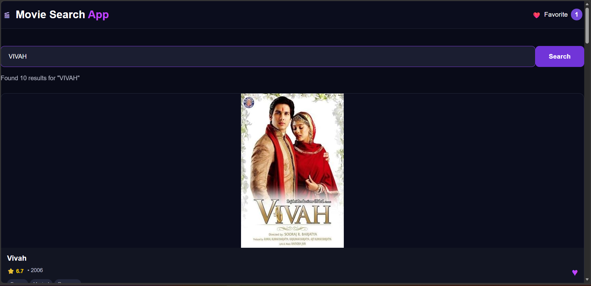

🎬 Movie Search App

A responsive and interactive Movie Search App built using HTML, CSS, and JavaScript.

The application allows users to search for movies and view useful movie information such as posters, ratings, release year, and genres.

✨ Features

🔍 Search movies by name
🎬 Display movie posters
⭐ Show IMDb ratings
📅 Show release year
🎭 Display movie genres
❤️ Add and remove favorite movies
💾 Save favorites using LocalStorage
⏳ Loading message
❌ Error handling
⌨️ Search using the Enter key
📱 Fully responsive design
🌙 Modern dark UI

🛠️ Technologies Used
HTML5
CSS3
JavaScript

📸 Screenshot

Add your project screenshot here after completing the UI:

Screenshot.png

Then use:

🎯 Future Improvements

🎞️ Movie Details popup
❤️ Dedicated Favorites section
🔎 Advanced filtering 
📄 Pagination
🌟 Better movie recommendation
🎨 More UI animations

👩‍💻 Author

Yamuna Gupta

Built with ❤️ using HTML, CSS and JavaScript.
